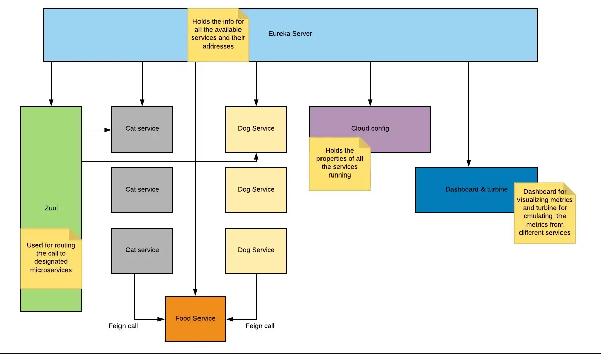
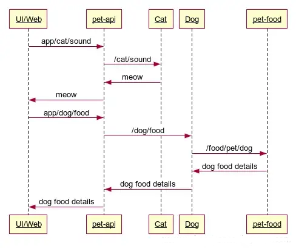

# From Spring Cloud to Cloud Native - For Java Developers

[Spring Cloud](https://www.springcloud.io/) 是 [Spring Boot](https://spring.io/projects/spring-boot) 和 最早由 Netflix 开源的几个分布式计算的组件的集合, 为 [Java 语言](http://java.net/) 开发的[微服务](https://microservices.io/)提供了应用运行支撑平台. 由于时代的局限, 基于 Spring Cloud 开发的应用仍要将分布式计算逻辑写入代码, 造成开发、构建和测试的不便. 在当前应用容器化的时代, Spring Cloud 中的众多分布式计算的功能与 [Kubernetes](https://kubernetes.io/) 和其[云原生生态](https://www.cncf.io/)中的[服务网格](https://istio.io/latest/about/service-mesh/)的功能重叠, 造成了基于 Spring Cloud 的应用系统在 Kubernetes 上部署运行时体现出了痈肿, 低效和运维困难. [OpenShift 容器平台](https://github.com/openshift)是目前集成度最高的 Kubernetes 发行版, 下文详述了将一个基于 Spring Cloud 的示例应用化简并以云原生的方式在 OpenShift 容器平台上实现全部原有功能的过程.  


## Spring Cloud 示例应用
示例应用使用的 Spring Cloud 组件:  
1. Eureka, 服务注册和发现;  
2. Config, 统一配置管理;  
3. Feign & Ribbon, 服务调用和负载均衡;  
4. Hystrix & Zipkin, 融断, 限流, 调用链追踪;  
5. Zuul, 服务调用网关;  
6. Turbine, 应用运行指标监视.  


示例应用架构如图所示:  
  


调用次序如图所示:  
  


示例应用代码详见: https://github.com/27rahulk/cloud-pet-project 或 spring-cloud-pet-project 目录.  

示例应用的介绍请参考: https://medium.com/@27.rahul.k/build-a-sample-project-with-spring-cloud-using-cloud-config-eureka-zuul-feign-hystrix-and-378b16bcb7c3  


## 应用化简
Spring Cloud 的 Eureka 实现了应用实例的注册发现; Config Server 实现了应用配置的云化, 即, 在任何节点上运行的应用都能够成功加载其配置; Feign 和 Ribbon 在客户端提供了负载均衡的实现; Hystrix & Zipkin 为服务提供了融断, 限流和调用链追踪的功能; Zuul 为所有服务提供统一的调用入口; Turbine 提供可视化的应用运行指标. 现在来看, 这些功能显得老旧, 并且在安全性方面有欠缺, 可以方便地通过网络访问获取应用的信息和配置, 例如:  
  
访问 Config Server 获取应用配置...  
```
curl http://localhost:8888/pet-eureka.properties
eureka.client.fetch-registry: false
eureka.client.register-with-eureka: false
server.port: 8761
```

此外, Spring Cloud 的分布式计算功能都要在代码中添加, 若调整则要进行代码变更并重新编译, 使得应用代码并不是专注于业务逻辑的实现, 在开发和调试时还要启动众多分布式计算的基础服务, 效率不高.  

因此, 应用云原生化的第一步就是化简, 剥离 Spring Cloud 组件的注释和配置, 成为纯粹的 Spring Boot 的应用, 实现服务的幂等性, 服务通过名称(命名服务)相互调用, 与外部服务交互的方式一致.  

应用化简后, 从 7 个工程变为 3 个. 对代码和配置进行了如下的调整:  

注释掉 pom.xml 中没有用的依赖...  
```
...
	<properties>
                ...
		<!-- spring-cloud.version>Finchley.RELEASE</spring-cloud.version -->
	</properties>

	<dependencies>
                ...
		<!-- dependency>
			<groupId>org.springframework.cloud</groupId>
			<artifactId>spring-cloud-starter-netflix-eureka-client</artifactId>
		</dependency>
		<dependency>
			<groupId>org.springframework.cloud</groupId>
			<artifactId>spring-cloud-starter-netflix-hystrix</artifactId>
		</dependency>
		<dependency>
			<groupId>org.springframework.cloud</groupId>
			<artifactId>spring-cloud-starter-openfeign</artifactId>
		</dependency -->

	</dependencies>

	<!-- dependencyManagement>
		<dependencies>
			<dependency>
				<groupId>org.springframework.cloud</groupId>
				<artifactId>spring-cloud-dependencies</artifactId>
				<version>${spring-cloud.version}</version>
				<type>pom</type>
				<scope>import</scope>
			</dependency>
		</dependencies>
	</dependencyManagement -->
...
```

注释掉 java 代码中没有用的代码和引用...  
```
//import org.springframework.cloud.client.circuitbreaker.EnableCircuitBreaker;
//import org.springframework.cloud.client.discovery.EnableDiscoveryClient;
//import org.springframework.cloud.netflix.hystrix.EnableHystrix;
//import org.springframework.cloud.openfeign.EnableFeignClients;

...
//@EnableDiscoveryClient
//@EnableFeignClients
//@EnableCircuitBreaker
//@EnableHystrix
...
```

服务调用客户端使用 RestTemplate 替代 Feign...  
```
//import org.springframework.cloud.openfeign.FeignClient;
//import org.springframework.web.bind.annotation.GetMapping;
//import org.springframework.web.bind.annotation.PathVariable;
import org.springframework.beans.factory.annotation.Value;
import org.springframework.stereotype.Service;
import org.springframework.web.client.RestTemplate;

//@FeignClient(value="pet-food", fallback=FoodFallbackService.class)
//public interface FoodService {
//	@GetMapping(path="/food/pet/{type}")
//	public String getFood(@PathVariable("type") String petType);
//}
@Service
public class FoodService {
	@Value("${pet-food.url}")
        private String url;

        public String getFood(String petType) {
                String content = "food details is not available for cats at the moment! try again later.";
                try {
                        RestTemplate client = new RestTemplate();
			String uri = url + "/food/pet/" + petType; 
			content =  client.getForObject(uri, String.class);
                } catch (Exception e) {
                        e.printStackTrace();
                }
                return content;
        }
}
```

注释掉 properties 配置中没有用的内容, 添加被调用服务的 url 地址 ...  
```
...
#spring.application.name=cat
#eureka.client.serviceUrl.defaultZone=http://localhost:8761/eureka/
#feign.hystrix.enabled=true
#hystrix.metrics.enabled=true
...
pet-food.url=http://<domain-name>:<port>
```

使用 spring-boot maven plugin 打 jar 包...  
```
mvn clean install spring-boot:repackage

java -jar target/<app-service>-0.0.1-SNAPSHOT.jar
```

化简后的示例应用代码详见: cloud-native-pet-project 目录.  


## 应用云原生化
应用云原生化的第二步是容器化. 应用容器化并不仅仅是把应用打包成镜像以容器方式运行, 而是要让应用在 Kubernetes 上部署运行并遵从其最佳实践.  

因此应用需要遵循相关的[设计原则](https://www.redhat.com/cms/managed-files/cl-cloud-native-container-design-whitepaper-f8808kc-201710-v3-en.pdf).  


### 生成应用镜像
容器借鉴了 Java 应用一次编译能到处运行的特点, 并进一步将操作系统的配置, Java 虚拟机和应用程序都固化, 并从技术上避免了被篡改. 应用程序无论在测试环境, 还是生产环境, 都完全一样, 运行时通过加载不同环境的配置.  

可以用传统写 Dockerfile 的方式, 也可以用 Red Hat 提供的 s2i(Source to Image) 生成应用镜像, 例如:  
```
oc new-build --binary=true --image-stream=java:openjdk-8-ubi8 --name=cat-service

oc start-build cat-service --from-file=./cat-service-0.0.1-SNAPSHOT.jar --follow
```


可以从 OpenShift 内部镜像仓库访问构建好的镜像, 也可以从 quay.io 下载, 推送到本地镜像仓库:  
```
podman pull quay.io/lshu_cn/food-service:latest

podman pull quay.io/lshu_cn/cat-service:latest

podman pull quay.io/lshu_cn/dog-service:latest
```


### 应用配置云化
应用配置加载在 Kubernetes 上由 ConfigMap 和/或 Secret 来实现. Secret 用 Base64 编码, 通常存放证书, 密码等. 可以是单个配置, 也可以是目录中的多个配置, 都在应用容器启动时以只读方式绑定到容器的本地文件系统. 不同应用的配置可以通过命名空间进行隔离.  

在配置文件中指定的 pet-food.url=http://food-service:8080, 指的是 Food Service 的名字, Kubernetes 提供了服务名字解析, 容器应用在 Kubernetes 环境中通过 Service 名字交互.  

将 properties 文件生成 ConfigMap 对象:  
```
oc create configmap cat-service-config --from-file=app-config/cat-service/

oc create configmap dog-service-config --from-file=app-config/dog-service/

oc create configmap food-service-config --from-file=app-config/food-service/
```

在应用部署的 yaml 文件中指定加载的 configmap 对象, 并在环境变量中指定运行 Spring Boot 应用所用的配置文件, 避免误加载 Jar 包中的本地配置文件.  
以 cat-service 的部署文件为例:  
```
...
spec:
  replicas: 1
  selector:
    matchLabels:
      deploymentconfig: cat-service
  template:
    metadata:
      annotations:
        sidecar.istio.io/inject: "true"
      labels:
        deploymentconfig: cat-service
        app: cat-service
    spec:
      containers:
      - image: registry.ocp4.example.com:5000/sm-workshop/cat-service:latest
        imagePullPolicy: Always
        name: cat-service
        ports:
        - containerPort: 8080
          protocol: TCP
        resources: {}
        terminationMessagePath: /dev/termination-log
        terminationMessagePolicy: File
        resources:
          limits:
            memory: 512Mi
            cpu: 200m
        volumeMounts:
        - name: app-config
          mountPath: /home/jboss/app-config
          readOnly: true
        readinessProbe:
            httpGet:
              path: /actuator/health
              port: 8080
              scheme: HTTP
            initialDelaySeconds: 3
            timeoutSeconds: 1
            periodSeconds: 20
            successThreshold: 1
            failureThreshold: 10
        livenessProbe:
            httpGet:
              path: /actuator/health
              port: 8080
              scheme: HTTP
            initialDelaySeconds: 3
            timeoutSeconds: 1
            periodSeconds: 20
            successThreshold: 1
            failureThreshold: 10
        env:
        - name: SPRING_CONFIG_LOCATION
          value: /home/jboss/app-config/
        - name: SPRING_PROFILES_ACTIVE
          value: prod
        - name: TZ
          value: Asia/Shanghai
      volumes:
      - name: app-config
        configMap:
          name: cat-service-config
...
```

### 应用注册发现
在 Kubernetes 上是由应用部署, 即 Deployment 和 StatefulSet, 来实现. 若是无状态的应用, 则使用 Deployment; 若是有状态的应用, 则使用 StatefulSet. 不同应用可以通过命名空间进行隔离.  

容器应用部署即注册, 信息保存在 ETCD 中, 可通过 Kubernetes API 访问到. 可以手工指定实例数量, 也可以设定规则自动伸缩.  

可以通过 OpenShift 的控制台页面或者命令行工具部署应用容器并查看应用容器信息:  
```
oc apply -f cat-service-deploy.yaml

oc apply -f dog-service-deploy.yaml

oc apply -f food-service-deploy.yaml

oc get pod
NAME                            READY   STATUS    RESTARTS   AGE
cat-service-59d6b5f6bf-ndvtk    2/2     Running   0          24m
dog-service-75888c78c9-pkwhz    2/2     Running   0          2m39s
food-service-6c99578787-5f4vm   2/2     Running   0          2m
```

### 应用访问控制
在 Kubernetes 上提供了 Service 对象, 为容器应用提供统一的地址和名称, 并为其多个实例提供负载均衡. 服务调用客户端只需要访问 Service 名字和端口即可.  

服务网格则在 Kubernetes 的基础上提供更高级的服务访问控制和应用访问入口, 例如, 可调比例的多版本应用流量, 错误重试, 融断, 限流, 调用链追踪和可视化的应用运行指标等.  

服务网格的功能都通过配置实现, 实时生效, 无需重新编译应用, 支持 Java, .Net, Python, C/C++ 等各种编程语言开发的应用.  

可以通过 OpenShift 的命令行工具统一管理这些配置:  
```
oc create -f gateway.yaml
```

现在就可以访问服务了. 先获取 istio gateway 的 url, 然后用 curl 访问:  
```
GATEWAY_URL=$(oc get route istio-ingressgateway -n user1-istio --template='http://{{.spec.host}}')

echo $GATEWAY_URL

curl $GATEWAY_URL/app/cat/sound

curl $GATEWAY_URL/app/cat/food

curl $GATEWAY_URL/app/dog/sound

curl $GATEWAY_URL/app/dog/food
```

可以根据服务的SLA, 自定义规则, 请参考 [istio 配置文档](https://istio.io/latest/docs/).  


### 应用运行监视
在 OpenShift 控制台页面提供了基本的容器运行时监视, 如, 总体的 CPU, 内存和网络占用, 通过命名空间进行隔离.  

服务网格则针对启用服务网格的容器应用, 提供了更细化的指标监视, 如, 单个 POD 的 CPU, 内存, 应用响应时长等.  

结合 OpenShift 控制台和服务网格, 可以满足各方面的容器应用监视需求, 无论是平台资源情况, 还是应用的问题诊断.  


用脚本访问应用页面若干次, 就可以看到可视化的应用指标了...  
```
for ((i=1;i<=100;i++)); do curl -s -o /dev/null $GATEWAY_URL/app/cat/sound; done

for ((i=1;i<=100;i++)); do curl -s -o /dev/null $GATEWAY_URL/app/cat/food; done

for ((i=1;i<=100;i++)); do curl -s -o /dev/null $GATEWAY_URL/app/dog/sound; done

for ((i=1;i<=100;i++)); do curl -s -o /dev/null $GATEWAY_URL/app/cat/food; done
```
kiali 显示的调用链...  
  

grafana 显示的应用指标...  
  


## 总结
综上, 将基于 Spring Cloud 的应用的云原生化并不复杂. 云原生应用本身的开发难度低, 效率高, 但 Kubernetes 和其最佳实践需要附加的学习成本. 建议以《云原生应用开发规范》为指引进行应用开发, 并由应用架构组审查并实现 Kubernetes 和 Service Mesh 的相关配置, 能够进一步地提升应用系统的开发, 部署和运维效率.  

Java 是面向对象的语言, 在业务逻辑实现方面有天然的优势, 但启动慢, 内存占用大的缺点一直没有被解决. 在云原生时代, [GraalVM](https://www.graalvm.org/) 和 [Quarkus](https://quarkus.io/) 让 Java 语言焕发青春. 通过将基于 Quarkus 的 Java 应用编译成原生可执行文件, 可以极大地缩短启动速度, 降低内存占用. 如感兴趣, 请参考 https://developers.redhat.com/e-books/quarkus-spring-developers 了解如何基于 MicroProfile 规范开发原生 Java 应用.  


